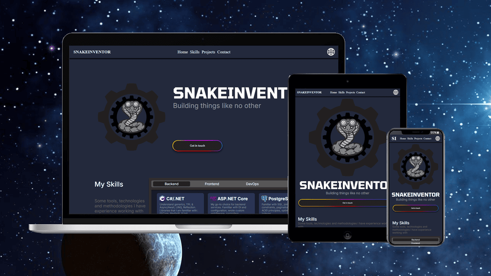

# Portfoliosis 


## About
Portfoliosis is a personal project, featuring fully responsive single-page portfolio website built with Vite, React and Typescript, containerized with docker and served by nginx. The ASP.NET Core backend handles, validates and persists messages in a PostgreSQL database.

## Installation
Requirements: bash, git, docker, ssl certificates for both website and backend.

### I: Set up folder structure
#### Clone the repo
```
git clone https://github/snakeinventor/portfoliosis
```

#### Or 


1. Create folders:
    * Create `portfoliosis` root folder and go inside.
    * Create `backend` folder with `certs` inside.
    * Create `frontend` folder with `certs` inside.
2. Download docker compose:
    * Download `docker-compose.yaml` and put it into the root folder.

### II: Add certificates
1. Add certificates for backend:
    * Add the CA certificate with key packed with Personal Information Exchange (.pfx) format to `backend/certs` and rename it to `portfoliosisbackend.pfx`.
2. Add certificates for frontend:
    * Add CA certificate to `frontend/certs` and rename it to `portfoliosis.crt`,
    * Then add key for the certificate and rename it to `portfoliosis.key`.
    * Finaly add backend certificate in Privacy-Enhanced Mail (.pem) format and rename it to `portfoliosisbackend.pem`

### III: Export database credentials

1. Export user environment variable. Replace "user" with name of your choosing.
```
export POSTGRES_DB_USER="user"
```

2. Export password environment variable.. Replace "password" with strong password.
```
export POSTGRES_DB_PASSWORD="password"
```
Or you can skip this part and specify them later with `-e` arguments in docker compose up.

### IV: Launch the application
Make sure you are in the root directory, then launch the application.
```
docker compose -f docker-compose.yaml up
```